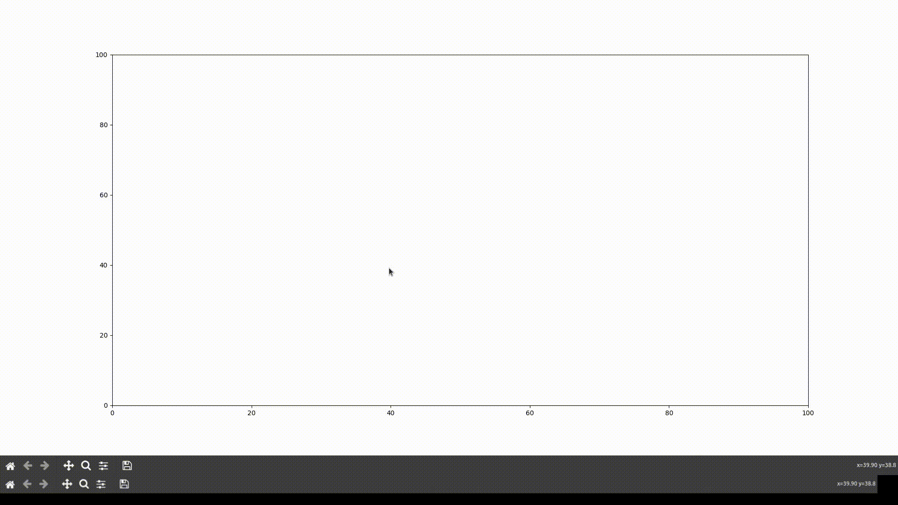

# Interactive Lagrange Interpolation
A small program that uses `matplotlib` to plot points and interpolate between them in real time.
<p align="center">

</p>
# Usage
```
$ pip install -r requirements.txt
$ python3 interactive_lagrange.py
```
- Click to add points
- Press `c` to clear the plot
- Press `-` to zoom out
- Press `=` to zoom in
